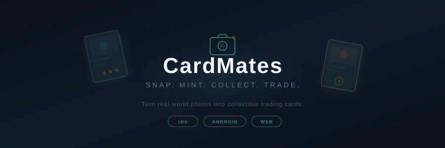

<p align="center">
  
</p>

<p align="center">
  <b>Turn real-world photos into collectible trading cards.</b><br/>
  <sub>Snap a photo. Mint a card. Trade it with friends.</sub>
</p>

<p align="center">
  
  
  
  
  
  
</p>

<br/>

## The Idea

What if anything you could photograph could become a collectible? CardMates turns your phone's camera into a minting press. Take a photo of anything — your dog, a sunset, a latte — and it becomes a unique trading card with dynamically assigned rarity. Collect them, trade them with friends, auction the rare ones, and climb the leaderboard.

It's a social card game powered by real life.

<br/>

---

<br/>

## How It Works

```
    📸 Snap a Photo
         │
         ▼
   ┌────────────┐
   │  Mint Card  │──── Rarity assigned dynamically
   └─────┬──────┘     (Common → Legendary)
         │
    ┌────┴─────┐
    │          │
    ▼          ▼
 🃏 Collect   🔄 Trade
    │          │
    ▼          ▼
 📊 Sets &    🏛️ Auction
 Leaderboard     House
```

1. **Snap** — Open the camera and photograph anything
2. **Mint** — The photo becomes a trading card with auto-assigned rarity, stats, and art
3. **Collect** — Build your collection, complete themed sets, unlock rewards
4. **Trade** — Send trade offers to other players in your group
5. **Auction** — List rare cards on the auction house with live bidding and dynamic rarity shifts
6. **Compete** — Climb group leaderboards, earn coins and gems, unlock new sets

<br/>

---

<br/>

## Features

**Card Minting**
- Camera-to-card pipeline — snap a photo and get a fully styled trading card
- Dynamic rarity system — rarity shifts based on auction demand and bid activity
- Collectible sets with completion bonuses

**Economy**
- Dual currency — coins (earned through gameplay) and gems (premium)
- In-app purchases via Stripe
- Coin rewards for daily activity, set completion, and trading

**Auction House**
- Live bidding with real-time updates
- Dynamic rarity — cards get rarer as more people bid
- Background auction completion with automatic payouts
- Bid history and auction analytics

**Trading**
- Direct player-to-player card trades
- Trade offers with multi-card support
- Balance transfers alongside card swaps

**Social**
- Group-based gameplay — create or join groups with friends
- Per-group leaderboards (collection value, trade volume, auction wins)
- Player profiles with stats, level, and XP progression

**Notifications**
- Push notifications for bids, trades, auction results
- Configurable alerts per event type

<br/>

---

<br/>

## Architecture

```
┌──────────────────────────────────────────────┐
│              React Native (Expo 53)           │
│  ┌──────────┐ ┌──────────┐ ┌──────────────┐ │
│  │Collection│ │ Auction  │ │   Trades     │ │
│  │  Screen  │ │  Screen  │ │   Screen     │ │
│  └────┬─────┘ └────┬─────┘ └──────┬───────┘ │
│       └─────────────┼──────────────┘         │
│                     ▼                         │
│         ┌─────────────────────┐              │
│         │  Service Layer       │              │
│         │  Caching · Batching  │              │
│         │  Read Tracking       │              │
│         └──────────┬──────────┘              │
└────────────────────┼─────────────────────────┘
                     │
        ┌────────────┼────────────┐
        ▼            ▼            ▼
  ┌──────────┐ ┌──────────┐ ┌──────────┐
  │ Supabase │ │ Firebase │ │  Stripe  │
  │ Postgres │ │ Functions│ │ Payments │
  │ Auth/RLS │ │ Overview │ │          │
  └──────────┘ │  Docs    │ └──────────┘
               └──────────┘
```

The app uses a **read-optimized architecture** designed around Firestore's pricing model:

- **Overview documents** — Cloud Functions maintain pre-aggregated summaries so the client reads 1 document instead of querying entire collections
- **Aggressive caching** — In-memory cache with TTL, request deduplication, and circuit breakers
- **Read budgeting** — Target of <10 Firestore reads per session, enforced by a production monitor that samples and alerts
- **Batch operations** — Writes are consolidated to minimize round trips

<br/>

---

<br/>

## Tech Stack

| Layer | Technology |
|-------|-----------|
| **App** | React Native, Expo SDK 53, React Navigation |
| **UI** | React Native Paper, Poppins font, Lottie animations |
| **Database** | Supabase (Postgres + Row-Level Security) |
| **Legacy Backend** | Firebase Cloud Functions (overview doc sync) |
| **Auth** | Supabase Auth |
| **Payments** | Stripe (in-app purchases) |
| **Notifications** | Expo Notifications |
| **State** | React Context + Zustand |
| **Storage** | Supabase Storage (card images) |

<br/>

---

<br/>

## Getting Started

```bash
# Clone
git clone https://github.com/stefanbocane/Mint-It-.git
cd Mint-It-

# Install
npm install

# Configure
cp .env.example .env
# Add your Supabase, Firebase, and Stripe keys

# Run
npm start
# Scan the QR code with Expo Go, or:
npm run ios       # iOS simulator
npm run android   # Android emulator
```

<br/>

---

<br/>

## Current Status

The core gameplay loop is complete — minting, collecting, trading, and auctioning all work end to end. The app has been migrated from Firebase to Supabase for auth and primary data, with Firebase Cloud Functions still handling the overview document pattern for read optimization. Stripe integration is in place for the premium currency.

Actively working toward App Store and Google Play submission.

<br/>

---

<p align="center">
  <sub>MIT License</sub><br/>
  <sub>Built by <a href="https://github.com/stefanbocane">Stefan Bocanegra</a></sub>
</p>
